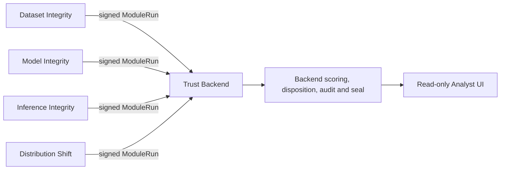

# DRISHTI

DRISHTI is a local, air-gap-ready integrity-assurance workstation for computer-vision
data, models, inference outputs, and deployment distribution evidence. It combines
bounded heuristic detectors with authenticated provenance, backend-owned assurance
scoring, a tamper-evident audit chain, immutable assessment snapshots, and a read-only
analyst UI.

DRISHTI provides evidence and integrity assurance. It does not prove that a model is
safe, guarantee the absence of backdoors, or formally verify detector correctness.
Cryptographic authentication proves producer identity and exact submitted bytes—not
that a detector's conclusion is correct. No findings does not mean safe.

## Architecture



All modules emit the frozen 11-field Finding Schema v1. The backend alone calculates
module scores, assessment coverage, system assurance, disposition, and lifecycle.
Distribution analysis does not produce a global drift score. The frontend performs no
assurance or disposition calculation.

An authenticated module run may contain zero findings. Its signed run proves execution,
but the module remains `UNKNOWN`, has no score, and contributes zero coverage. DRISHTI
does not manufacture a PASS finding.

## Prerequisites

- Linux x86-64 (validated on Kali Linux; CI uses Ubuntu)
- Python 3.11–3.14 with `venv`
- Node.js 22 or newer and npm 10 or newer
- POSIX process controls and Linux `resource`/`RLIMIT` semantics for bounded ONNX workers

Windows and macOS worker-resource behavior have not been validated.

## Quick start

The canonical evaluator setup is:

```bash
git clone --branch main git@github.com:OgataJiraiya/drishti-trust.git
cd drishti-trust
make setup
make demo
```

`make setup` creates `.venv`, installs the declared Python dependencies, and performs a
locked `npm ci`. It never modifies system Python. `make demo` runs the bounded concern
scenario against an automatically created loopback backend and temporary database/keys.
No external model, API, telemetry, or cloud service is contacted.

Run the zero-finding semantic scenario separately with `make demo-clean`.

## Start the workstation

Terminal 1:

```bash
export DRISHTI_ADMIN_BEARER_TOKEN='choose-a-local-runtime-secret'
export DRISHTI_DATA_DIR="$PWD/runtime/data"
export DRISHTI_KEY_DIR="$PWD/runtime/keys"
export DRISHTI_PORT=8000
make backend
```

Terminal 2 — seed the already-running backend with a real sealed concern assessment for
the live UI:

```bash
export DRISHTI_ADMIN_BEARER_TOKEN='choose-a-local-runtime-secret'
export DRISHTI_API_URL=http://127.0.0.1:8000
make demo-live
```

The command prints the new assessment ID. It runs the same real four-module detector and
signed-ModuleRun flow as `make demo`, but persists the resulting assessment in the live
backend instead of deleting temporary backend state.

Terminal 3:

```bash
export VITE_DRISHTI_API_URL=http://127.0.0.1:8000
make frontend
```

Open `http://127.0.0.1:5173`, select the assessment ID printed by `make demo-live`, and
inspect the workstation. Live mode is explicit for this command. The backend permits
browser reads only from loopback origins. Use the same loopback port for
`DRISHTI_API_URL` and `VITE_DRISHTI_API_URL` when changing the backend port.

An absent database initializes automatically through SQLAlchemy `create_all`. Receipt
and checkpoint Ed25519 keys are generated into `DRISHTI_KEY_DIR`; demo module keys are
ephemeral and remain inside the demo process. Rerunning `make demo` is the safe isolated
reset: each invocation uses and removes a new temporary directory. There is no generic
database wipe command.

## Validation

Run `make test`. Independent suites can be run with `.venv/bin/python -m pytest -q`
against `backend/tests`, `tests/model_integrity`, `tests/distribution_shift`, or
`tests/data_integrity`. See [the evaluator demo runbook](docs/DEMO_RUNBOOK.md).

## Trust boundaries and non-guarantees

- `VERIFY != ACCEPT`; receipt verification is read-only while acceptance consumes replay state.
- Signature validity is not behavioral or model safety.
- Filename is not identity; digest identity is not behavioral safety or authenticity.
- `UNKNOWN != SAFE`; no findings is neither safety nor a completed assessment lifecycle.
- Complete coverage is not safety.
- Finding confidence is evidence confidence, not attack probability.
- Finding recommendation is not system disposition.
- Distribution findings do not infer maliciousness, cause, performance loss, or safety.

Known limitations include heuristic detectors/scoring, bearer-token MVP access control,
`create_all` rather than migrations, no trusted timestamp/HSM, checkpoint-key compromise,
total database destruction, and the need to pin clean-tail checkpoints externally. See
[full-system integration](docs/FULL_SYSTEM_INTEGRATION.md) for details.

## Real organization assessments

`make demo` uses controlled fixtures. Live **New Assessment** (`/new-assessment`) accepts organization-provided ONNX and optional bounded evidence, runs existing detectors, submits signed ModuleRuns and seals a backend assessment. It uses a short-lived local intake capability, never the admin bearer in the browser. See [Organization Assessment](docs/ORGANIZATION_ASSESSMENT.md) for setup, supported formats, explicit behavioral opt-in, security, limits and CLI fallback.
